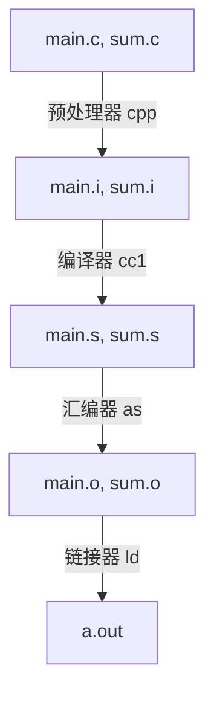

# 复习
[TOC]
## 信息的处理与表示
+ 字长：32或64，决定虚拟地址空间的最大大小
+ 运算优先级
+ 整数范围
## 程序的机器级表示
+ x86-64 指令长度从1到15个字节不等
+ 编译器会在ret后面加入nop使代码对齐
+ PF（parity flag奇偶校验位）：执行算数或逻辑运算时，如果得到的运算结果的低8位中有偶数个1，那么就会把PF置1；浮点比较时，任意一个操作数为`nan`都会将PF设置为1

| 术语 | 字(word) | 双字(double word) | 四字(quad word) |
| ---- |:--------:|:-----------------:|:---------------:|
| 长度 |    16    |        32         |       64        |

+ 指令生成或复制一个值到寄存器时，如果新值的长度为1字节或2字节时，高位字节保持不变，新值的长度为4字节时，高位字节置0
+ 调用者保存：%rax,6个参数和%r10,%r11
+ 6个整形参数（按顺序）：%rdi,%rsi,%rdx,%rcx,%r8,%r9,六个以上的整形参数入栈
+ 用栈传递参数时，所有数据大小向8对齐
+ 寄存器的名称

| 64(q) | 32(l) | 16(w) | 8(b) |
|:-----:|:-----:|:-----:|:----:|
| %rax  | %eax  |  %ax  | %al  |
| %rbx  | %ebx  |  %bx  | %bl  |
| %rcx  | %ecx  |  %cx  | %cl  |
| %rdx  | %edx  |  %dx  | %dl  |
| %rsi  | %esi  |  %si  | %sil |
| %rdi  | %edi  |  %di  | %dil |
| %rbp  | %ebp  |  %bp  | %bpl |
| %rsp  | %esp  |  %sp  | %spl |
|  %r8  | %r8d  | %r8w  | %r8b |

%r8-%r15的命名规则与%r8相同

### x86-64指令集
+ 常用条件码
    + CF：进位标志。最近的操作使最高位产生了进位。
    + ZF：零标志。最近的操作得到的结果为0.
    + SF：符号标志。最近的操作的到的结果为负数。
    + OF：补码溢出标志。最近的操作导致一个补码溢出（正溢出或负溢出）。
+ **不设置条件码**的指令
    + `mov`
        + `movq`只能以表示为32位补码的立即数作为源操作数；`movabsq`能够以任意的64位立即数值作为源操作数，并且只能以寄存器为目的
        + `movz`对高位进行0扩展，没有`movzlq`，因为`movl`会自动把目的寄存器高位置0
        + `movs`对高位进行符号扩展，`cltq`把%eax符号扩展到%rax，`cltq`没有操作数
    + `pushq %rsp`存到栈里的是`%rsp`的原值
    + `popq %rsp`存到`%rsp`中的是stack上的值
    + `leaq`不改变条件码
    + `set`访问条件码
        + 根据条件码的组合，将一个字节设置为0或1.
        + 单操作数。目的操作数必须为低位单字节寄存器或一个字节的内存位置。
        + 会有同义名，如`setnle`和`setg`同义，都表示有符号数大于。
        + 无符号数用的是CF与ZF的组合，a,b无符号，`a < b`时`a - b`会使CF置1；有符号数用的是SF,OF,ZF的组合
    + 跳转指令
        + 直接跳转：跳转目标作为指令的一部分编码。给出一个标号作为跳转目标，例如`jmp .L1`
        + 间接跳转：跳转目标从寄存器或内存位置读出。写法是`*`后面跟一个操作数指示符，例如`jmp *%rax`,`jmp *(%rax)`
        + 只有无条件跳转才能间接跳转；条件跳转只能直接跳转
            + 执行PC相对寻址时，PC的值是**跳转指令后面的那条指令的地址**，并且偏移量是一个有符号数，**比如`je $-16`会编码为`74 F0`，编码中是个有符号数！**
        + 对于`set`和条件跳转指令，后缀`s`表示负数，`ns`，表示非负数，`g`,`ge`,`l`,`le`比较有符号数，`a`,`ae`,`b`,`be`比较无符号数
    + 条件传送
        + 源操作数是寄存器或内存，目的操作数为寄存器。
        + 源和目的操作数的长度可以为16位，32位，64位，不可以为单字节
        + 对于条件传送，汇编器可以从目标寄存器的名字推断出条件传送指令的操作数长度， 对于所有的操作数长度，都可以使用同样的条件传送指令的名字
    + `call`，将`call`指令之后的语句的位置加入stack
    + `ret`，从栈上取回返回值，增加`%rsp`并设置PC
+ **设置条件码**的指令
    + 所有除`leaq`以外的整数算数操作
        + 一元操作：`inc`,`dec`,`neg`,`not`，操作数可以是一个寄存器或一个内存位置
        + `inc`,`dec`会设置OF,ZF，但是不改变CF
        + 二元操作：`add`,`sub`,`imul`,`xor`,`or`,`and`
        + 对于`xor`，CF，OF被设为0
        + 对于二元操作，第一个操作数可以是立即数，寄存器，或者内存位置；第二个操作数可以是寄存器或内存位置。第二个操作数为内存位置时，处理器必须从内存读出值，执行操作，再讲结果写回内存
        + `sal`,`shl`,`sar`,`shr`
        + 对于移位操作，CF会被设置为最后一个被移出的位，OF设为0
        + 移位操作第一个操作数可以是立即数，也可以放在单字节寄存器`%cl`中
    + `cmp`,`test`只设置条件码
        + `cmp`基于减法
        + `test`基于与运算
+ 特殊算数操作
    + 单目`imulq`,单目`idivq`，有符号全乘法和有符号全除法，操作为`%rax * S`
    + 单目`mulq`,单目`divq`，无符号全乘法和无符号全除法，被除数128位，为`R[%rdx]:R[%rax]`，除数64位，是指令后面跟的参数`S`
    + 对于乘法操作，128位运算结果放在`R[%rdx]:R[%rax]`
    + 对于除法操作，余数存在`%rdx`，商存在`%rax`
    + `cqto`，把`%rax`中的值符号扩展为八字（128位），结果放在`R[%rdx]:R[%rax]`
+ switch
    + 当开关情况数较多，值的范围跨度比较小时，gcc会使用跳转表
    + gcc声明跳转表的扩展语法
    ```c
        /* Table of code pointers */
        static void *jt[7] = {
            &&loc_A, &&loc_def, &&loc_B,
            &&loc_C, &&loc_D, &&loc_def,
            &&loc_D
        };
    ```
    + 将`index`看做无符号值，简化分支的可能性
    + 跳转表存在`.rodata`段
+ ISO C99允许定义变长数组，变长的数组必须利用乘法计算地址，不能用一系列的加法和移位，可能会带来性能损失
+ 数据对齐
    + 对齐原则：任何K字节的**基本对象**的地址必须是K的倍数
    + 结构体的地址按结构体内最大元素需要的对齐规则对齐
+ 浮点操作（尚未整理，详见课本P204）
    + 把浮点数值转化为整数时，会执行截断并向0舍入
## 处理器体系结构
1. 一个处理器支持的**指令**及其**字节编码**称为**指令集体系结构**
2. 程序员可见状态
    + 程序寄存器
    + CC条件码
    + PC
    + Stat程序状态
    + DMEM内存
3. 默写SEQ-Y86
    + 指令编码：单寄存器指令irmovl用rB，其余用rA. rmmovl mrmovl一律用D(rB)
    + valP在Fetch阶段获得
    + 写回阶段只会用到valE和valM，不会用到valC和valA,valB
    + 访存时会用到valA
    + 设置条件码的写法`Cnd <- Cond(CC, ifun)`
    + E阶段，如果要加0，写成 0 + val，如果要加减4，写成 val + 4 或 val + (-4)
    + E阶段，写在前面的数是ALU_B
    + M阶段，读写都要用下标注明读写多少位
    + call在D阶段用rB
    + 所有指令都会计算valP
    + `pushl %esp`存到栈里的是`%esp`的原值
    + `popl %esp`存到`%esp`中的是stack上的值
4. Pipeline
    + 吞吐量：单位时间内执行的指令数，以GIPS为单位时，表示1ns执行的指令数
    + 延迟：完成单条指令需要的时间
    + P298旁注
    + 遇到ret指令，需要插入3个nop
        + 遇到ret后，F阶段会错误地取出三条一样的指令
        + 对于cret，如果F阶段没有stall，那就会错误地取出3条不同的指令；如果F阶段stall，那就会错误地取出两条指令，其中第二条指令被取出两次
    + jXX分支预测错误在E与D插泡
    + load/use hazard：上一条指令需要从内存中读取值（mrmovl,popl)，并且当前指令需要使用该值作为源操作数
    + 处理load/use hazard：在E插泡，D暂停，这种方法叫**加载互锁(load interlock)**
    + 当处于访存或写回阶段的指令导致异常时，流水线控制逻辑必须禁止更新条件码寄存器或是数据内存。由于到达写回阶段的指令顺序与SEQ相同，所以第一条造成异常的指令会停止程序并更新Stat。取消指令只发生在jXX分支预测错误的时候，发现预测错误最多取出两条指令，最深的指令只执行了D，不会改变程序员可见状态，可以放心取消。
    + 注意转发顺序
    ``` swift
    word d_valA = [
        D_icode in {ICALL, IJXX} : D_valP;
        d_srcA == e_dstE : e_valE;
        d_srcA == M_dstM : m_valM;
        d_srcA == M_dstE : M_valE;
        d_srcA == W_dstM : W_valM;
        d_srcA == W_dstE : W_valE;
        1 : d_rvalA;
    ];
    ```
    + F阶段不能插入气泡，每个周期都会取一条指令。对于上一条指令是ret的情况，取出的指令在D阶段变成气泡，因此ret会导致连续三个周期取出错误的指令
    + 访存阶段出现异常时，在M插入气泡，并在写回阶段暂停异常指令（P316 图4-63）
    + 注意特殊控制的条件，（P316 图4-64）
    + 气泡和暂停信号均为1被看成出错
    + 分支预测错误可能和ret组合，加载使用可能和ret组合
        + 类似的，我们可以知道cret可能和ret组合，不可能和预测错误与加载使用组合
    + ret和加载使用组合时，ret会在D暂停一个周期
+ CISC vs RISC
    + CISC（x86-64）
        + 指令数量多
        + 单条指令延迟可能很长
        + 取址方式多样
        + 可以对内存和寄存器操作数进行算数和逻辑运算
        + 实现细节不可见
        + 有条件码
        + 可以用栈存取过程参数，**用栈存返回地址**
    + RISC
        + 指令数量少
        + 单条指令延迟很短
        + 指令定长
        + 简单寻址方式，单独的load/store指令
        + 只能对寄存器操作数进行算数和逻辑运算
        + 实现细节可见
        + 没有条件码，测试结果放在寄存器
        + 用**寄存器**存取过程参数和**返回地址**，有些过程能完全避免内存引用；通常会有很多寄存器（最多有32个）
## 优化程序性能
1. 妨碍优化的因素
    + 内存别名使用：两个指针可能指向同一个内存位置的情况
    + 函数调用
        + 用内联函数优化函数调用，gcc只尝试单个文件中函数的内联
        + 内联函数不能再调试时设置断点；利用代码剖析的方式评估程序性能时，内联函数无法被正确剖析
2. CPE：每元素的周期数
3. 关于现代处理器
    + 一条只对寄存器操作的指令会转化成一个操作，一条包含一个或多个内存引用的指令，会产生多个操作，**把内存引用和算术运算分开**
    + 任何对程序寄存器的更新只会在指令退役时发生，只有处理器确定导致这条指令的所偶遇分支都正确了，才会这样做。
    + 寄存器重命名
        + 一条更新寄存器`r`的指令，在译码阶段产生标识符`t`
        + `(r,t)`被加入重命名表
        + 执行单元得到结果`(v,t)`
        + 所有需要用到`t`结果的操作可以使用`v`作为源
        + 重命名表只包含未进行写的寄存器条目
    + 资源分布

| 操作                            | 容量 |
| ------------------------------- |:----:|
| load(with address computation)  |  2   |
| store(with address computation) |  1   |
| integer                         |  4   |
| integer mul                     |  1   |
| FP mul                          |  2   |
| FP add                          |  1   |
| FP div                          |  1   |

| 操作                | 延迟 | 发射时间 |
| ------------------- | ---- | -------- |
| Load/Store          | 4    | 1        |
| Integer multiply    | 3    | 1        |
| Integer/Long divide | 3-30 | 3-30     |
| FP multiply         | 5    | 1        |
| FP add              | 3    | 1        |
| FP divide           | 3-15 | 3-15     |
4. 优化方法
    + 代码移动：把代码中多次计算但是结果不变的部分移动到不会被多次计算的部分，比如减少在循环的条件判断中的函数调用
    + 循环展开
        + 注意浮点操作重新结合后得到的结果可能会发生变化
5. 限制因素
    + 寄存器溢出：并行度p超出可用寄存器的数量，某些临时变量会放在内存中
    + 分支预测错误处罚
        + 不要过分关心可预测的分支
        + 用容易生成条件传送的代码风格
6. 内存性能
    + 储存不会影响寄存器的值，一系列的储存不会引起数据相关，只有加载操作会受到影响（读写相关，会造成CPE的增加）
    + 储存缓冲区包含已经发射到储存单元但是还没有完成的储存操作和数据，这里的完成包括更新告诉缓存
    + 写内存时，地址必须要比数据先算出来（这是需要在数据流图中表现出来的数据相关）
## 储存器层次结构
+ 磁盘储存
    + 读取时间为ms级，比DRAM慢10万倍，比SRAM慢100万倍
    + 磁盘由多个叠放在一起的盘片组成
    + 盘片上有表面
    + 表面分为磁道
    + 磁道被分为扇区
    + 磁盘上到主轴距离相等的磁道组合为柱面
    + 多个连续柱面组合成记录区
    + 同一个区的每条磁道都有相同的扇区数
    + 磁盘容量
    $$
    磁盘容量 = \frac{字节数}{扇区} \times \frac {平均扇区数}{磁道} \times \frac {磁道数}{表面} \times \frac{表面数}{盘片} \times \frac{盘片数}{磁盘}
    $$
    + 对于磁盘制造商$1GB = 10^9字节$，$1TB=10^{12}字节$
    + 对于DRAM，SRAM：$K=2^{10}$，$M=2^{20}$，$G=2^{30}$
+ 磁盘操作
    + 在任何时刻，所有的读写头都在同一个柱面上
    + 访问时间
        + 寻道时间
        + 旋转时间：平均旋转时间是最大旋转时间的一半
        + 传送时间：读一个扇区需要的时间
        + 寻道时间和旋转时间数量级相同，往往远大于传送时间
    + 逻辑块：一个B个扇区大小的区域，由磁盘控制器维护逻辑块号和实际磁盘扇区之间的关系
    + 先读到磁盘控制器的小缓冲区中，再复制到主存
    + 直接内存访问(DMA)：设备可以自己执行读或者写总线事务而不需要CPU干涉的过程，这种数据传送成为DMA传送(DMA transfer)
+ SSD读比写快
    + 数据是以页为单位读写的，只有在一页**所属的块整个被擦除**之后才能写这一页
    + 一旦一个块被擦除了，块中每一个页都可以不需要再擦除就能写一次
    + 随机写慢的原因
        + 擦除块需要很长时间
        + 需要修改已有数据的页p，这个块中所有带有用数据的页必须被复制到一个新的（擦除过）的块，然后才能对页p写
+ 局部性
    + 标量没有空间局部性
+ 缓存不命中
    + 替换（驱逐）：覆盖一个现存的块，被覆盖的块称为牺牲块
    + 替换策略
        + 随机替换策略
        + 最不常使用（LFU）：替换过去某个时间窗口内引用次数最少的一行
        + 最近最少使用（LRU）：替换最后一次访问时间最久远的一行
    + 缓存不命中的分类
        + 冷缓存：空的缓存
        + 强制性不命中（冷不命中）：因为缓存为空导致的不命中
        + 冲突不命中：某些对象会映射到同一个缓存块，所以缓存会一直不命中
        + 工作集：循环每个阶段访问缓存块的某个不变的集合
        + 容量不命中：工作集超过缓存大小
    + 缓存管理

| 缓存     | 管理者                        |
| -------- | ----------------------------- |
| 寄存器   | 编译器                        |
| L1,L2,L3 | 缓存中的硬件逻辑              |
| DRAM     | 操作系统软件和CPU地址翻译硬件 |

| 缓存      | 缓存什么       | 何处      | 延迟 |
| --------- | -------------- | --------- | ---- |
| CPU寄存器 | 4字节或8字节字 | CPU寄存器 | 0    |
| L1        | 64字节块       | L1        | 4    |
| L2        | 64字节块       | L2        | 10   |
| L3        | 64字节块       | L3        | 50   |
| 虚拟内存  | 4KB页          | 主存      | 200  |
+ Cache
    + 什么叫路(行)，什么叫组
    + 设E代表每组行数
    + E = 1时，称作直接映射高速缓存
    + 1 < E < C/B时，称作E路组相联高速缓存
    + E = C/B时，称作全相联高速缓存，全相联高速缓存没有组索引位
    + 可以通过添加填充消除抖动
+ 写数据
    + 写命中的情况下
        + 直写：立即将对应高速缓存块写回下一层
        + 写回：只有当块被驱逐时，才会更新下一层；需要一个修改位来指明是否有修改
    + 写不命中的情况
        + 写分配：加载低一层的块到高速缓存中，更新高速缓存块
        + 非写分配：避开高速缓存，直接把这个字写到低一层中
    + 常见搭配
        + 直写$\times$非写分配
        + 写回$\times$写分配
+ 高速缓存参数对性能的影响
    + 高速缓存大小
        + 大的高速缓存可能会提高命中率
        + 高速缓存过大可能会运行得慢
        + 较大的高速缓存可能会增加命中时间
    + 块大小
        + 大的块有利有弊
        + 块越大：可能提高命中率；缓存总大小给定情况下行数变少，可能损害命中率；不命中处罚大
    + 相联度
        + 相联度高：降低抖动；较高成本；速度很难变快；更多标记位；复杂度增加，增加命中时间；牺牲行的复杂性增加，不命中处罚大
        + i7中，L1，L2 8路组相联，L3 16路组相联
    + 写策略
        + 直写容易实现，能用独立于高速缓存的写缓冲区更新内存，
        + 写回引起的传送比较少，允许更多的到内存的带宽用于执行DMA的I/O设备
        + 越往下走，传送时间越长，越倾向于用写回
+ 储存器山
    + 读吞吐量（读带宽）：单位时间内读取的数据量
    + 步长为1的平坦山脊：Core i7的预取机制造成，自动识别步长为1的引用模式，试图在块被访问前就将他们存到告诉缓存中

## 链接
+ 编译过程

+ 符号
    + 目标文件定义和引用符号
    + 函数，全局变量和静态变量
+ 目标文件
    + 可重定位目标文件
    + 可执行目标文件
    + 共享目标文件
+ 目标文件格式（第一个Unix：a.out，Linux和现代Unix：elf，Windows： PE，Mac OS X：Mach-O）
+ ELF
    + ELF头：16字节
    + 节
        + `.text` 机器代码
        + `.rodata` 只读数据（格式字符串和跳转表）
        + `.data` 已初始化的全局和静态变量
        + `.bss` 未初始化（初始化为0）的全局或静态变量
        + `.symtab` 符号表（不包含局部变量）
            + 全局符号
            + 外部符号
            + 静态符号`static`
        + `.strtab` 字符串表，符号名，节名
        + 伪节：不出现在节头部表的节，只有可重定位目标文件中有，可执行目标文件没有
            + `ABS`不该重定位的符号
            + `UNDEF`当前模块未定义却引用的符号（未定义的函数等）
            + `COMMON`未初始化的全局变量（弱符号），未初始化的静态变量和初始化为0的全局和静态变量放到`.bss`
    + 节头部表
+ 强弱符号
    + 强符号：函数和已初始化的全局变量
    + 弱符号：为初始化的全局变量(`COMMON`)
    + 不能有多个同名强符号
    + 有一个强符号和多个弱符号同名，选择强符号
    + 有多个弱符号，随便选一个
+ 存档(`.a`)
    + 头部：描述每个成员的大小和位置
    + 一堆`.o`文件
+ 注意`gcc`参数传递的顺序
    + 链接器从左到右解析参数
    + 检查当前未定义符号集合
        + 如果新的输入文件是`.o`，那就直接把它加进来
        + 如果新的输入文件是`.a`，只有未定义符号对应的`.o`被加进来
+ 重定位（**一定要注意小端法和大端法表示**）
    + 首先由链接器决定段的运行时地址`ADDR(s)`和符号的运行时地址
    + `refptr = s + r.offset`是文件中需要被修改的部分
    + 相对寻址`R_X86_64_PC32`
        + `refaddr = ADDR(s) + r.offset`是被修改部分的运行时地址
        + `*refptr = ADDR(r.symbol) + r.addend - refaddr`修改对应部分`r.addend`可以是个负数
    + 绝对寻址`R_X86_64_32`
        + `*refptr = ADDR(r.symbol) + r.addend`，`r.addend`可以为0
    + **注意，如果是小端法表示的机器，写入时候高位在后，低位在前**
+ 可执行文件调用
    + `_start`入口点
        + `__libc_start_main`
            + `main`
+ 位置无关代码
    + 编译动态链接库必须使用`-fpic`选项
    + 全局偏移量表`GOT`
        + 每个条目8字节
        + 由动态链接器进行重定位
        + 存各个量的绝对地址
    + 过程链接表`PLT`
        + 每个条目16字节
        + 函数调用时使用延迟绑定
        + 各个函数的`GOT`初始化为对应`PLT`第二条指令的位置
        + 第一次调用时候，会调用动态链接器进行绑定，把`GOT`表目改为函数的绝对地址

## 异常控制流
+ 异常：控制流中的突变，用来相应处理器状态的某些变化
+ 通过异常表进行间接过程调用，运行异常处理程序，异常处理程序结束后，可能有以下三种情况
    + 返回当前指令
    + 返回下一条指令
    + 终止程序
+ 异常表在启动时初始化
+ 异常由处理器触发，一些必要的信息被压倒内核栈中，异常处理程序运行在内核态下
+ 异常的类型

| 类型 | 原因              | 异步/同步 | 返回行为                                                | 例子                                                   |
| ---- | ----------------- | --------- | ------------------------------------------------------- | ------------------------------------------------------ |
| 中断 | 来自I/O设备的异常 | 异步      | 总是返回到下一指令                                      | 网络适配器，定时器                                     |
| 陷阱 | 有意的异常        | 同步      | 总是返回下一条指令                                      | 系统调用                                               |
| 故障 | 可以修复的错误    | 同步      | 可能返回到当前指令（如果处理失败进入内核中的abort进程） | 缺页异常，触发错误（浮点异常），一般保护故障（段错误） |
| 终止 | 不可恢复的错误    | 同步      | 不返回（进入内核中的abort）                             | 硬件损坏，机器检查                                     |
+ 异常号`0~31`由`Intel`的架构师定义，`32~255`是由操作系统定义的中断和陷阱
+ 进程：执行中程序的实例
+ 上下文切换
    1. 保存当前进程上下文
    2. 恢复某个先前被抢占的进程被保存的上下文
    3. 将控制传递给新恢复的进程
+ 可能引起上下文切换的情况
    + 系统调用
    + 中断（计时器）
+ 进程的三种状态：运行，停止(挂起)，终止
+ 进程终止原因
    + 收到默认行为是终止的信号
    + 从主程序返回
    + 调用`exit`
+ `fork`
    + 子进程获得和父进程用户级虚拟地址空间的副本（代码，数据段，用户栈，堆，共享库）
    + 打开文件描述符副本
+ 子进程必须手动回收，父进程提早终止的话`init`进程就会成为其子进程的养父
+ 用`waitpid`回收僵死进程
+ 既不能被捕获也不会能被忽略的信号：`SIGKILL`，`SIGSTOP`，并且他们的默认行为不能修改
+ 接收信号
    + 接收信号发生在进程从内核模式回到用户模式的时候
    + 如果待处理信号集合非空，选择某个（通常是最小的）信号k，强制当前进程执行
    + 信号处理程序可以被其他信号中断
+ 信号阻塞
    + 隐式阻塞：默认阻塞当前信号处理程序正在处理的信号
    + 显示阻塞：`sigprocmask`
+ 信号安全
    + 异步信号安全：可重入或不能被信号中断
    + 保存和恢复`errno`
    + `volatile`声明全局变量
    + `sig_atomic_t`读写是原子的

## 虚拟内存
+ 内存管理单元`MMU`被封装在CPU芯片中，将虚拟地址翻译为物理地址
+ 虚拟地址空间：`{0,1,2, ... , N-1}`，一定有$N = 2^n$
+ 地址空间大小：表示最大地址需要的位数`n`
+ 虚拟页：未分配，缓存，未缓存
+ DRAM缓存全相联，任何虚拟页可以放在任何的物理页中
+ PTE：页表条目
+ 缺页：DRAM缓存不命中
    + 触发缺页异常，进行页面调度
    + 返回到触发缺页异常的指令
+ 分配页面：在磁盘上创建空间并更新PTE
+ 页表加许可位对内存进行保护
+ 记号

| 符号 | 描述               |
| ---- | ------------------ |
| VPO  | 虚拟页面偏移量     |
| VPN  | 虚拟页号           |
| TLBI | TLB索引            |
| TLBT | TLB标记            |
| PPO  | 物理页偏移         |
| PPN  | 物理页号           |
| CO   | 缓冲块内字节偏移量 |
| CI   | 高速缓存索引       |
| CT   | 高速缓存标记       |
| PTBR | 页表基址寄存器     |

+ 地址翻译
    1. 处理器生成虚拟地址传给MMU
    2. MMU产生PTEA，传给高速缓存/内存
    3. 高速缓存/内存传PTE给MMU
    3. MMU检查有效位，如果页命中，直接构造物理地址，从高速缓存/内存中读取相应条目
    4. 如果有效位为0，MMU触发异常，控制传递给缺页异常处理程序
    5. 缺页异常处理程序进行页面调度，并更新PTE
    6. 返回原进程，重新执行造成缺页的指令，重新进行步骤1
+ 用TLB缓存页表，VPN低位作为TLBI，高位作为TLBT
+ 采用多级页表时，1级页表用VPN最高的几位作为索引，2级页表用次高位作为索引，以此类推。
+ 有TLB的存在，多级页表不会比单级页表慢很多
+ Linux虚拟内存系统
    + 组织成区域（段）的集合
    + 区域：已经存在着的虚拟内存的连续片
+ 内存映射
    + 请求匿名文件时在磁盘和内存之间没有实际的数据传送
+ 共享对象
    + 写时复制：被写之前标记位只读，第一次写时触发保护故障，故障处理程序注意到是一个写时复制的私有对象，于是复制对应页面，并且给副本写权限
+ `execve`
    1. 删除当前虚拟地址的用户部分中已经存在的区域结构（包括全局变量和用户栈）
    2. 映射私有区域（用户栈和堆都是请求二进制零的）
    3. 映射共享区域
    4. 设置PC
+ 垃圾收集

## 系统级I/O
+ 输入输出是在主存和外部设备之间复制数据的过程
+ 内核记录打开文件信息，应用程序只需要记住这个描述符
+ 标准输入(0)，标准输出(1)，标准错误(2)
+ 进程终止时，内核关闭打开文件，释放内存
+ 文件类型：普通文件，目录，套接字
+ 共享文件
    + 文件描述符表：进程私有
    + 文件表：共享
        + 文件位置，`refcnt`
    + v-node：共享
+ `getc`函数使用了标准库打开的输入流缓冲区，需要注意`fork`时它的行为
+ 标准I/O注意事项
    + 如果中间没有`fflush, fseek, rewind`，输入函数不能跟在输出函数之后
    + 如果中间没有`fseek, fsetpos, rewind`，输出函数不能跟在输入函数之后，除非该输入函数遇到一个EOF

## 网络编程

1. 客户端-服务器模型中的基本操作是事务
2. 事务
    1. 客户端向服务器发送请求
    2. 服务器解析请求，操作资源
    3. 服务器给客户端发送响应
    4. 客户端接收响应并处理
3. 网络
    + 互联网：局域网通过路由器相互连接
        + 路由器
        + 广域网（WAN）：路由器之间的连接
        + 局域网（LAN）：网络最低层的结构，常用以太网实现
            + 网桥：链接多个以太网段。
            + 以太网段
                + 集线器：各个主机接到集线器，集线器链接网桥。发给某个集线器的消息，与该集线器相连的所有主机都能看到
4. 协议
    + 命名机制：定义统一的主机地址格式
    + 传送机制：传包
        + 包
            + 包头：包含包大小，源主机与目的主机的地址
            + 有效载荷：包含原主机发送的数据位
5. TCP/IP
    + IP
        + 定义了基本的命名方法和传送机制
        + 能够从一台**主机**向另一台**主机**发送包（数据报）
        + 包丢失或重复不恢复，不可靠
    + UDP
        + 构建在IP之上，可以在进程间传输包
    + TCP
        + 建立在IP协议之上
        + 能在进程间传送包
        + 可靠全双工（双向的）链接
    + IP地址：32位无符号整数（IPv4），使用网络字节顺序（大端法）
        + 点分十进制表示法：每个字节由它的十进制表示，用句点和其他字节分开
    + 端口：16位无符号数
6. 连接：套接字对
```
(cliaddr:cliport, servaddr:servport)
```
7. 接口
    + `listen`把主动套接字转换成被动套接字
    + `getaddrinfo`将主机名、主机地址、服务名、端口号的字符串表示转化成套接字地址结构。可重入。
    + `getnameinfo`将一个套接字地址结构转换成相应的主机和服务名字符串
