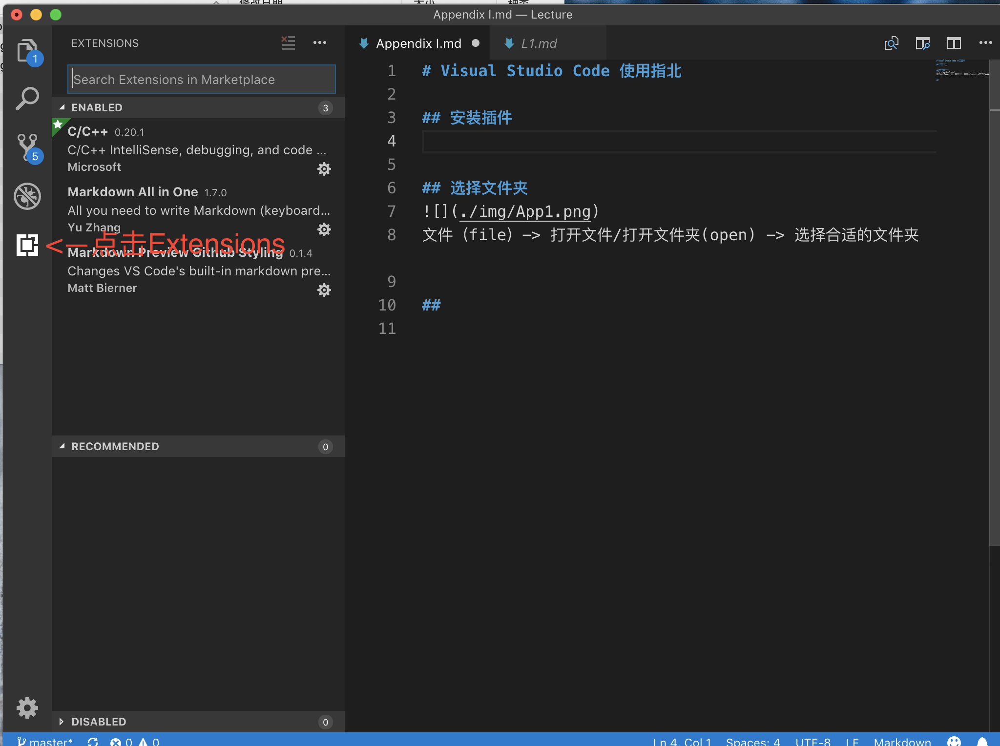
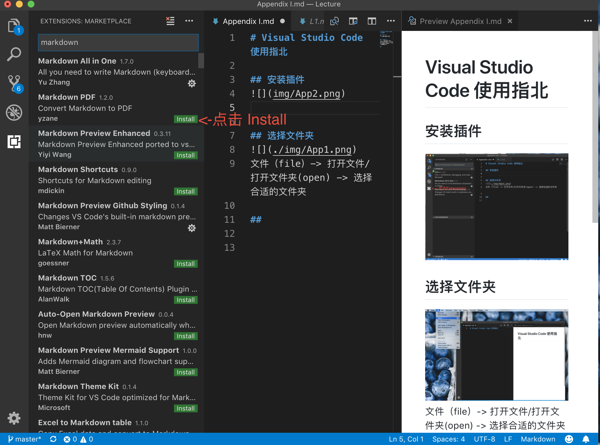
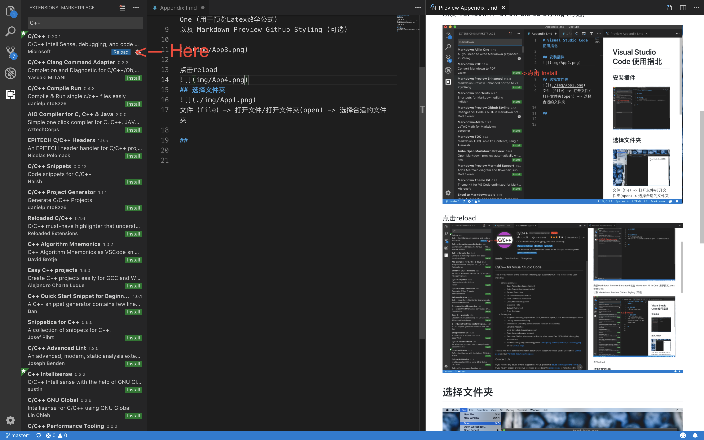
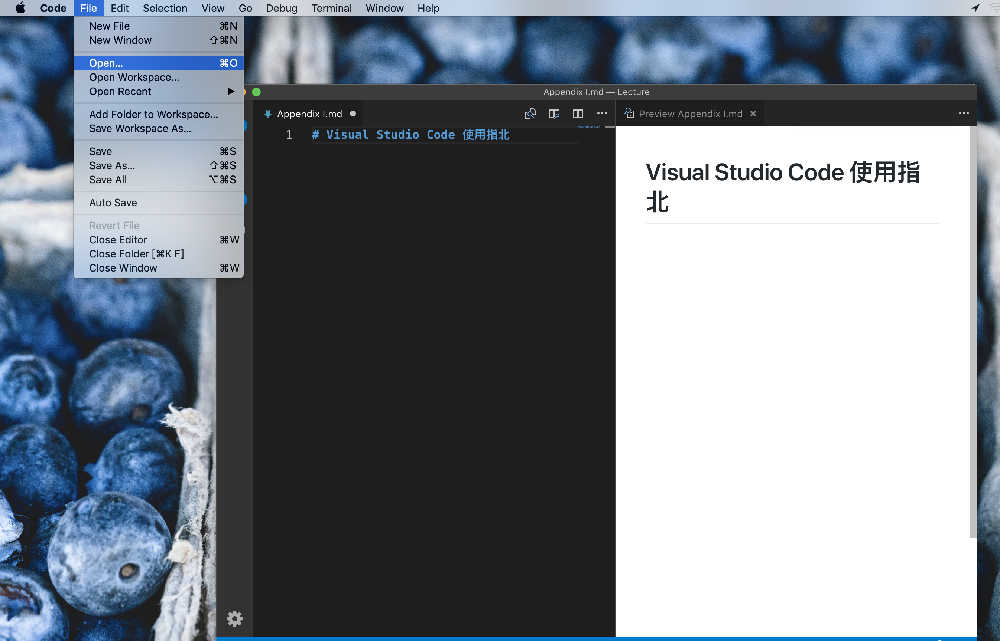
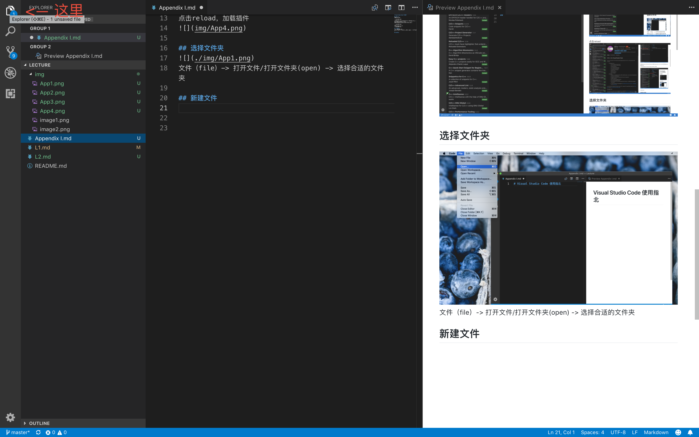

# Visual Studio Code 使用指北

## 安装插件  
点击Extensions  

  

安装Markdown Preview Enhanced 或者 Markdown All in One (用于预览Latex数学公式)  
以及 Markdown Preview Github Styling (可选)  

  

点击reload，加载插件
  

## 选择文件夹  

文件（file）-> 打开文件/打开文件夹(open) -> 选择合适的文件夹  

## 新建文件  
点击左侧左上角的Explorer  

   

点击New File  

  

将新文件名后缀命名为`.md`，就OK啦  
语法忘记了的话，参考[Github Style Markdown](https://help.github.com/articles/basic-writing-and-formatting-syntax/)   

