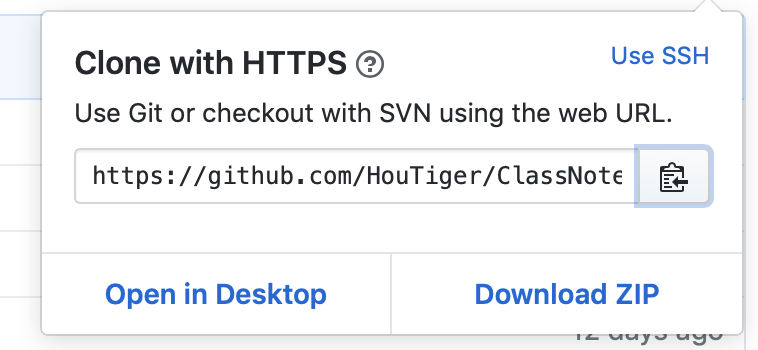
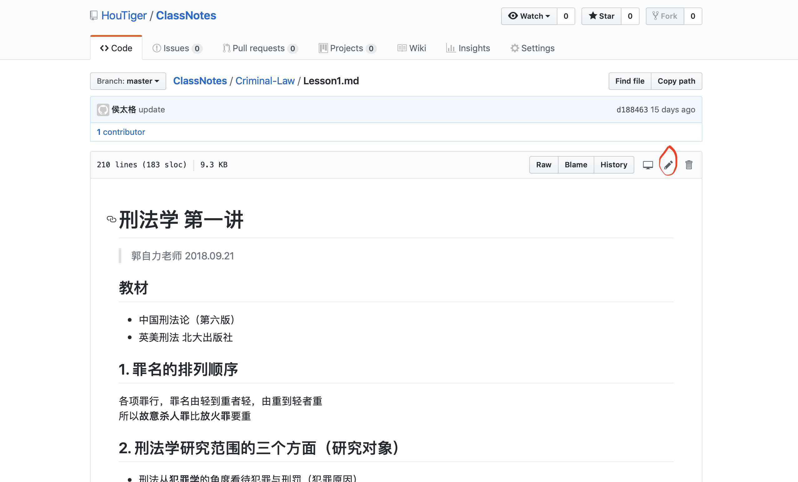

# Lesson 1
### 1. 命令行
* 进入目录  
```bash
cd filefolder
```
* 列出当前目录下所有文件   
```bash
ls
```  
* 新建目录   
```bash
mkdir new_filefolder_name
```  
* 移动文件到某个文件夹下  
```bash
mv file1 filefolder
```   
* 使用vim编辑文本文件  
```bash
vim filename
``` 
* 使用`Tab`键以自动补全
* [命令行参考资料1](https://www.cheatography.com/davechild/cheat-sheets/linux-command-line/)  
    [命令行参考资料2](https://ryanstutorials.net/linuxtutorial/cheatsheet.php)
### 2. Git的使用

首先，打开一个repository页面，点击clone or download，复制文本框中语句
  
  
在命令行中输入
`git clone` 并将地址粘贴进去，回车，就把一个目录克隆到了本地。
`cd`到这个目录下，我们就可以进行操作了。

在命令行输入
```bash
git status
```

这会输出距离你上一次`commit`所做的改动。

不一定所有的改动你都想交上去，你需要手动指定需要提交的文件

```bash
git add 需要提交的发生改动的文件或文件夹
```

比如你改了`README.md`，那就

```bash
git add README.md
```

一个个加太麻烦了，用下面的命令把所有的改动都加进去

```bash
git add *
```

> `git add *`往往需要配合`.gitignore`文件使用。你可以在`.gitignore`文件中写上希望`git`无视的文件或文件夹，这样这些文件夹的改动就不会被`git`跟踪。

加完了需要提交的改动，可以用`git status`查看当前仓库的状态。请仔细阅读显示的文字，看看`git status`说了什么，一般来说git会显示接下来可能用到的指令的提示。

指定完需要提交的变化之后，就可以确认（`commit`）了。

```bash
git commit -m '用简洁精炼的语言描述所做的改动'
```

`-m`表示`commit`对应的信息。这是必填项。对于`commit`的描述需要简洁明了，不然会显得很不专业。因为每提交一个版本都要写填写一次，所以这是我们对这一次`commit`核心内容的总结，也是区分不同版本的提示。

很好，我们确认了所有做过的改动，现在可以把本地内容推送（`push`）到`github`上。

直接在命令行输入如下命令即可

```bash
git push
```
有时候我们可以在网页端更改文件，点击红圈内的铅笔符号即可显示源代码

那么在本地终端再次打开这个目录时，先要把远程的改动同步到本地，输入
```bash
git pull
```
### 3. VSCode的使用
* 插件/extensions
    * Markdown Preview Enhanced
    * Markdown Preview Github Styling
    * Markdown PDF 
* 终端/terminnal  
    在终端操作git
### 4. Markdown和Latex语法
* [Github Style Markdown](https://help.github.com/articles/basic-writing-and-formatting-syntax/)   
    要注意在不同的平台上支持的`markdown`语法会略有不同
* [Latex语法参考1](http://www.mohu.org/info/symbols/symbols.htm)  
    [Latex语法参考2](https://blog.csdn.net/gsww404/article/details/78684278?fps=1&locationNum=9)
    * $\cfrac{x}{y}$
    * $e ^ {ax}$
    * $\lim_{x \to -\infty} ^ {\infty} \cfrac{sinx}{x}$


### 5. <del>网络环境优化<del>
* *vpn*
* *hosts*  
    用可用的hosts文件替换掉下面路径中的*hosts*文件  
    `c:\windows\system32\drivers\etc`

### 6. 写代码的杂七杂八
* 合理使用`sort`, `merge`, `memset`等库函数，注意sort可以自己改变比较大小的规则
```c++
struct str_tmp
{
    int val1, val2;
}
bool sort_compare(str_tmp x, str_tmp y)
{
    return x.val1 < y.val1;
}
sort(a, a + sizeof(a), sort_compare);
```
* 冒泡排序能不手写就不要手写，除非题目要求  
* 注意函数名和变量名要有意义，尽量不要`a, b, c, x, y, z`，使用**大写字母分割**或者**下划线分割**，如  
    `BinarySearch` or `binary_search`  
* 注意多次使用的大数组一定要在每次使用前利用`memset`设置为初始状态
* 如果可以的话，尽量不要使用指针，很容易错。  

    |                    |target value      |  
    |--------------------|------------------|  
    |**pointer value ->**|**target address**|  
    |**pointer address** |                  |


* 递归的写法就是`结束条件 + 初始状态`，不要想太多
* 等宽字体
    `consolas`,`courier`
* *debug*
    * 注意数组越界和访问越界有可能是`Wrong Answer`，也有可能是`Runtime Error`，所以如果你`WA`了，请优先考虑数组越界  
    * `Time Limit Exceeded`有三种可能，一种是死循环，一种是输入输出耗时过久，一种是算法复杂度过高
    * 可以利用`cout` 或者 `printf`将程序的中间数据输出出来，与正确情况对照，一般如果算法没错的话都能找到原因
