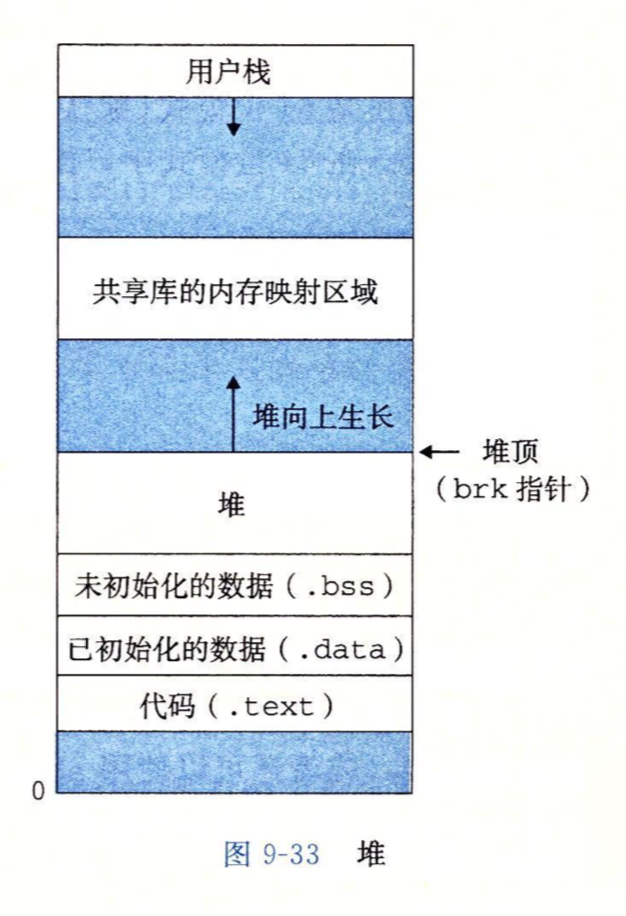

# Lesson3
## 文件的存储  
* 文本文件  
    内容以`ASCII`码存储  
* 二进制文件  
    自定义编码/其他编码  
* 所有文件在磁盘上都以二进制存储，只不过文本文件的编码格式我们确定为ASCII码
## 了解编译工具链
* 预处理器  
    `.c -> .i`  
    将`#include`的内容简单插入`.c`中  
    `gcc -E main.c`  
    `gcc -E main.c > main.i`  
    `> main.i`表示把程序的输出存储到`main.i`这个文件中
* 编译器  
    `.i -> .s`  
    将代码翻译成汇编语言  
    `gcc -S main.i`
    `gcc -S main.i > main.s`  
    `gcc -S main.c > main.s`  
* 汇编器   
    `.s -> .o`  
    将汇编语言翻译成机器语言，机器语言以一种叫做`relocatable object file`的格式存储    
    要注意到，汇编语言和机器语言是一一对应的，CPU只能看懂机器语言  
    `gcc -c main.s`  
    `gcc -c main.s > main.o`  
    `gcc -c main.c > main.o`
* 链接器  
    `.o -> .exe/.out`
    链接器将`.o`文件需要的在其他文件中定义的函数插入进来    
    `gcc -o main main.o`  
    `gcc -o main main.c`  
    

* 整个过程我们通常称之为编译，这一系列程序统称为编译系统，但通常我们叫做**编译器**  
    `c`语言和`c++`常用的编译器为`gcc`和`g++`

* `GCC` `gcc` `g++`
    * `GCC`是·`GNU Compiler Collection`  
        `GCC`可以编译多种语言，像`Aga, Fortran, C, C#, C++`，`GCC`包含`gcc`和`g++`
    * `gcc`是c语言的编译驱动程序，代表编译系统调用预处理器，编译器，汇编器，链接器
    * `g++`是c++的编译驱动程序    

## 强制类型转换
* 形式  
    ```c++
    double d;
    int a = int(d);
    a = (int)d;
    double *p1 = &d;
    int *p2 = (int *)p1;
    ```
* 什么情况下类型转换前后二进制变但值不变，什么情况下二进制不变呢


## 指针和数组 
* 什么是`NULL`?
    ```c++
    int *ptr = NULL:
    if (ptr)
    {
        return 0;
    }
    else
    {
        return 1;
    }
    ```
* 数组名是一个指向数组首元素的指针，也就是说指针的值是数组首元素的地址  
 
    ```c++
    // template <class T>
    int array[100];
    int *ptr = &array[0];
    if (array == ptr)
    {
        printf("%d", true);
    }
    else
    {
        printf("%d", false);
    }
    ```

* 引用`&` 和 解引用`*` 
    * `&`表示制造一个指向当前对象的指针  
        `&a[0][0][0] = a[0][0]`  
        也就是把当前对象的地址取出来  
        上升一层  
    * `*`表示取出指针指向的元素  
        `*a[0][0] = a[0][0][0]`  
        先取出指针的值，把指针的值当作地址，取出这个地址的值，取出多少个字节取决于指针的类型  
        下降一层  
    * 练习1
        * `&a[x][y][z] = ?`
            <!--
            &a[x][y][z] = a[x][y] + z
            -->
        * `*(a[x][y] + z) = ?`
            <!--
            *(a[x][y] + z) = a[x][y][z]
            -->
        * `*a[x][y] + z = ?`
            <!--
            *a[x][y] + z = a[x][y][0] + z
            -->
* 运算符优先级  

    | 运算符 | 优先级 | 结合顺序 |
    | --- | --- | --- | 
    | ... | ... | ... |   
    | ( ) [ ] | 2 | 由左到右 |  
    | *（取指针内容）, &（取地址） | 3 | 从右到左 |
    | * / % | 4 | 从左到右 |
    | + - | 5 | 从左到右 |
    | ... | ... | ... |  

    所以要时刻注意，`*（取指针内容）`的优先级高于四则运算`+ - * / %`  
* 对指针的加减  
    当指针加减`1`时，指针的值加减的是指针指向的元素类型的字节数  
    只有两个相同类型的指针之间才能进行加减运算  
    ```c++
    int a[20];
    int *ptr = &a[3]; // 不妨设ptr = 0x400000
    ptr += 1; // ptr = 0x400004
    ```

* 所以，判断一个指针指向元素的步骤是  
    * 消掉`&`和`*`
    * 判断指针类型
    * 进行加减运算 
    * 练习2 
        ```c++
        /* 问题又来了 */
        int a[4][8][16];
        for (int i1 = 0; i1 < 4; ++i1)
        {
            for (int i2 = 0; i2 < 8; ++i2)
            {
                for (int i3 = 0; i3 < 16; ++i3)
                {
                    a[i1][i2][i3] = i1 * i2 * i3;
                }
            }
        }
        printf("%d", *(&a[2][4][7] - 10) + 4);
        /* 求程序输出的值 */
        ```
        <!--
        a[2][3][13] = 2 * 3 * 13 = 78;
        78 + 4 = 82
        -->
        ```c++
        int a[10][10][10];
        cout << ______ << endl;
        // output = 148
        // 请利用指针加减法，使用a[1], a[2][4][8], &, *, +, - 填空
        ```
        <!--
        // a[2][4] + 8 - a[1][0] = 148
        -->
    * 练习3
        ```c++
        int a[3][4] = {{1, 2, 3, 4}, {5, 6, 7, 8}, {9, 10, 11, 12}};
        cout << "a = " << a << endl;// a = 0x7ffee43cbb70
        cout << "&a[0] = " << &a[0] << endl; 
        cout << "a + 1 " << a + 1 << endl;
        cout << "&a[0] + 1 " << &a[0] + 1 << endl; 

        cout << "a = " << a << endl;
        cout << "a[0] = " << a[0] << endl;
        cout << "&a[0][0] " << &a[0][0] << endl; // a[0]

        cout << "*a + 1 =  " << *a + 1 << endl; // a[0] + 1
        cout << "a[0] + 1 " << a[0] + 1 << endl;
        cout << "&a[0][0] + 1 " << &a[0][0] + 1 << endl; // a[0] + 1
        
        cout << "&a[2][0] " << &a[2][0] << endl;
        cout << "&a[3][0] " << &a[3][0] << endl;

        cout << "&a[2][3] " << &a[2][3] << endl;
        cout << "a[2] + 3 " << a[2] + 3 << endl;
        // 程序都输出什么呢？
        ```
* **数组的指针**和**指针的数组**
    * 练习4
    ```c++
    /* sizeof(a) = ? sizeof(p) = ? */
    /* a + 1 = ?, p + 1 = ? */
    int* a[100]; // a = 0x400030
    int (*p)[100]; // p = 0x400060
    cout << sizeof(a) << endl;
    cout << sizeof(p) << endl;
    cout << a + 1 << endl;
    cout << p + 1 << endl;
    /* 按照运算符的优先顺序来分析 */  
    ```

    <!--
    正常来讲，
    int (*p)[100]应该定义成 int [100] *p
    但是c++里面就是这样定义的:( 
    sizeof(a) = 800
    sizeof(p) = 8
    a + 1 = 0x400038
    p + 1 = 0x4001f8
    -->

* 动态分配内存 
    * c++中
    ```c++
    int *p1 = new int;
    int *p2 = new int(3);
    int *p3 = new int[3];
    delete p1;
    delete p2;
    delete[] p3;
    ```
    动态申请的内存必须回收，即每个`new`都要对应一个`delete`  
    否则会造成内存泄漏  
    因为动态申请的内存和全局变量都放在内存的堆里，局部变量都放在内存的栈里  
    当结束函数调用时，栈恢复原状，堆不会  
      
    * c中用的是`malloc`和`free`  
        形如
        ```c
        /* 
        malloc的参数为要申请的字节数，且malloc返回一个void*指针，
        要强制类型转换为相应的指针  
        */
        int *ptr = (int *)malloc(sizeof(int) * 128);
        free(ptr);
        // 等价于  
        int (*ptr)[128];
        ```
* 为什么要用指针？
    如果不知道需要数据规模的范围，就需要动态申请内存空间
    ```c++
    /* 比如现有n个整数，求中位数，且未给出n的取值范围 */
    int n;
    int *ptr = new int[n];
    /* sizeof(ptr) = ? */
    ```

## 编程的trick们  
* 宏定义  
    ```c
    #define NUM 5;// 可以定义常数
    #define sum(a, b) a + b // 也可以定义带参数的表达式  
    ```

    所以如果要定义一个在多个地方都要使用的**常量**，就可以使用宏  

    ```c++
    #define Max 200
    int a[Max];
    for (int i = 0; i < Max; i++)
        a[Max] = i;
    ```

* `main`函数的参数  
    ```c++
    int main(int argc, char **argv)
    {
        return 0;
    }
    // or
    int main(int argc, char *argv[])
    {
        char c[100];
        cin >> c;
        cout << (strlen(c) == strlen(argv[1])) << endl;
        return 0;
    }   
    ```
    `argv[0]`存储主函数的运行路径和程序名  
    `argv[1]`存储第一个参数，接下来类推  
* 缩进要使用4个`space`，不许用`tab`
* 多文件编程  
    * 区分函数的声明与定义  
    * `extern`   
        当文件中使用了不是本文件定义的**全局变量**时，要先声明一下变量是外部`extern`的    
        ```c++
        extern double d;
        ```
    * 当文件中使用了非本文件定义的函数时，也要先声明一下
        ```c
        int MySum(int a, int b);
        int main()
        {
            int a = 0, b = 1;
            MySum(int a, int b);
            return 0;
        }
        // main.c
        ```
        ```c
        int MySum(int a, int b)
        {
            return a + b;
        }
        // MySum.c
        ```
    * 当需要声明的函数太多时，我们把变量和函数的声明写在一个头文件里  
        c语言的头文件为`.h`  
        c++的头文件为`.hpp`   
        只要头文件不导致编译出错，写什么都可以  
        头文件的内容会在**预处理**的时候替换掉`#include <headerfile.h>`的内容 
    * 为了避免重复定义，我们将每个头文件写成这种形式  

        ```c++
        #ifndef headerfile
        #def headerfile
        // headerfile 
        #endif
        ```
        要注意，**重复声明**不会报错，**重复定义**的话编译时会报错  
    * 练习5   
        下面这种情况为什么会报错 
        ```c++
        #include <stdio.h>
        #include "MySum.hpp"
        #include "YourSum.hpp"
        int main()
        {
            int a = 0, b = 1;
            printf("%d\n", MySum(a, b));
            return 0;
        }
        // main.cpp
        ```
        ```c++
        #include "Sum.hpp"
        int MySum (int a, int b);
        // MySum.hpp
        ```
        ```c++
        #include "Sum.hpp"
        int YourSum(int a, int b);
        // YourSum.hpp
        ```
        ```c++
        int Sum(int a, int b);
        struct movie
        {
            char name[];
        }
        // Sum.hpp
        ```
        ```c++
        int MySum(int a, int b)
        {
            return a + b;
        }
        int YourSum(int a, int b)
        {
            return a + b;
        }
        int Sum(int a, int b)
        {
            return a + b;
        }
        // MySum.cpp
        ```
    * 要记住，编译命令中无需包含头文件  
        `g++ -o main main.cpp MySum.cpp`


