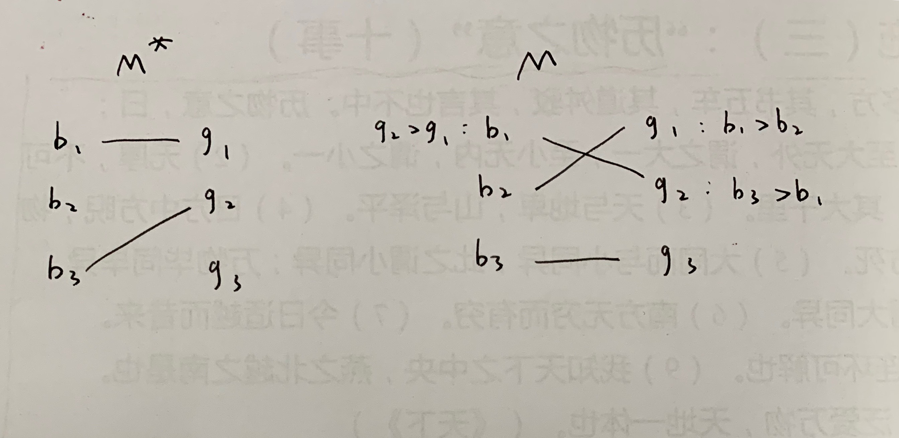

# 社会与市场中的计算问题选讲 第六次作业
## 1600012897 侯太格
1. 反证法证明BPA匹配是对女生最差的

设匹配$M^*$产生于BPA，另有稳定匹配M  
在$M^*$中，女生$g_1$与男生$b_1$匹配，在M中，$g_1$和$b_2$匹配，若假设不成立，则显然对$g_1$有 $b_1 > b_2$，女生匹配到的对象可以更差  
假设男生$b_1$在M中与$g_2$匹配，则为了保持稳定，M中对$b_1$有 $g_2 > g_1$  
则根据BPA算法我们可知，$M^*$中，$b_1$先约了$g_2$，惨遭拒绝，我们不妨设他是第一个遭到拒绝的男生  
不妨设$g_2$因为$b_3$拒绝了$b_1$，则对$g_2$有 $b_3>b_1$  
不妨设在M中，$b_3$匹配了$g_3$  
则分类讨论，
若有$b_3:g_2>g_3$，则M不稳定，矛盾
若有$b_3:g_2 < g_3$，则$b_3$先约了$g_3$，惨遭拒绝，然后才约到了$g_2$，且这一切在$b_1$被$g_2$拒绝之前发生，与假设矛盾  
所以得证，BPA匹配的结果是对女生最差的  

2. 
    不妨设 $b_{i_1} \ge b_{i_2} \ge ... \ge b_{i_n}$  
    则 $P = (b_{i_2}, b_{i_3}, ..., b_{i_{m + 1}})$
    且 $q_{j_1} \ge q_{j_2} \ge ... \ge q_{j_m}$  
    $v_{k_1} \ge v_{k_2} \ge ... \ge v_{k_n}$  
    如果满足市场均衡，则有$v_{i_1}q_{j_1} + ... + v_{i_m}q_{j_m} = v_{k_1}q_{j_1} + ... + v_{k_m}q_{j_m}$  

3. 证明GSP按估值出价的收入比VCG高 

    不妨设人数n，物品数m，$n > m$  
    则GSP按估值出价最后商家总收入为  
    $Income(GSP) = v_2q_1 + v_3q_2 + ... + v_{m+1}q_m$  
    而VCG出价的话，物品j的价格
    $p_j = \sum_{i = j+1}^m (v_{i+1} - v_i)q_i + v_{j+1}q_j = v_{j+1}q_j + \theta_j, 且 \theta_j < 0$  
    $Income(VCG) = \sum_{j = 1} ^ m p_j = v_2q_1 + v_3q_2 + ... + v_{m+1}q_m + \sum_{j = 1}^m\theta_j $  
    而$\sum_{j = 1}^m\theta_j < 0$
    则$Income(VCG) < Income(GSP)$  
    得证

4. 
* A

    | 点击率 | 广告位估值 | 广告位估值 | 广告位估值 | 点击估值 | 出价 | 实价 | 收益 |  
    |--------|------------|------------|------------|----------|------|------|------|
    | 8      | 56         | 21         | 7          | 7        | 7    | 6    | 8    |  
    | 3      | 48         | 18         | 6          | 6        | 6    | 4    | 6    |  
    | 1      | 32         | 12         | 4          | 4        | 4    | 0    | 4    |  

    若第一个人将出价降低为5，则实价为4，分得点击率为3的广告位，收益为3 * 7 - 3 * 4 = 9，收益增加  
    所以GSP按照估值出价不一定均衡  
* B

    | 点击率 | 广告位估值 | 广告位估值 | 广告位估值 | 点击估值 | 出价 | 实价 | 收益 |  
    |--------|------------|------------|------------|----------|------|------|------|
    | 5      | 75         | 45         | 15          | 15        |  15   |  8   | 35 |  
    | 3      | 40         | 24         | 8          | 8       |   8  |   5  |   9  |  
    | 1      | 25         | 15        | 5          | 5        |   5  |  0   |   5  |   

    如果A降价到5～8之间，则收益变为45 - 3 * 5 = 30 < 35
    如果A降价到5以下，收益变为15 < 35  
    如果B提价到15以上，收益为40 - 15 * 3 = -5 < 9  
    如果B降价到5以下，收益为8 < 9  
    如果C提价到8以上，收益为15 - 8 * 3 = -9 < 5  
    如果C提价到15以上，收益为25 - 15 * 5 = -50 < 5  
    所以按照估值出价，满足出价均衡

* C  
在课件中已经证明了在GSP下总有一种出价是均衡  
* D
对任意出价均衡，提高出价最高者的出价，显然得到的新的一组出价仍然满足出价均衡。  
对所有广告主来说，降价的情形都不变，所以不会获益  
提价的情形只有超过新的最高出价才会与之前不同，且由于最高出价升高，所以获利一定下降，所以也满足出价均衡  
* E  
根据课件中总有一种出价均衡的构造性证明，最后的出价均衡就满足社会最优  
因为按照v和q从大到小排列，则估值矩阵的对角线对应社会最优

